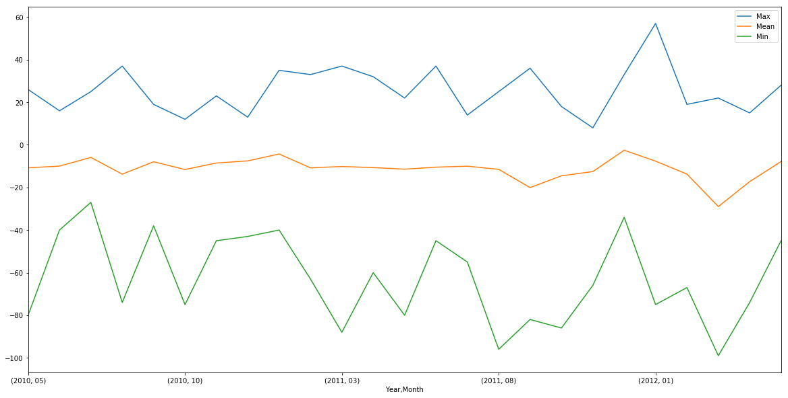

# Importing Data to Dataframe


```python
%matplotlib inline
import pandas as pd
import numpy as np
import matplotlib
loc = 'C:\\Users\\Tathya05\\Downloads\\WWW_dstae00023177.dat'
df = pd.read_table(loc, delim_whitespace=True, header=None)
df.head()
```


<div>
<style>
    .dataframe thead tr:only-child th {
        text-align: right;
    }

    .dataframe thead th {
        text-align: left;
    }

    .dataframe tbody tr th {
        vertical-align: top;
    }
</style>
<table border="1" class="dataframe">
  <thead>
    <tr style="text-align: right;">
      <th></th>
      <th>0</th>
      <th>1</th>
      <th>2</th>
      <th>3</th>
      <th>4</th>
      <th>5</th>
      <th>6</th>
      <th>7</th>
      <th>8</th>
      <th>9</th>
      <th>...</th>
      <th>18</th>
      <th>19</th>
      <th>20</th>
      <th>21</th>
      <th>22</th>
      <th>23</th>
      <th>24</th>
      <th>25</th>
      <th>26</th>
      <th>27</th>
    </tr>
  </thead>
  <tbody>
    <tr>
      <th>0</th>
      <td>DST1001*01</td>
      <td>X220</td>
      <td>0</td>
      <td>5</td>
      <td>4</td>
      <td>4</td>
      <td>2</td>
      <td>0</td>
      <td>0</td>
      <td>2</td>
      <td>...</td>
      <td>7.0</td>
      <td>3.0</td>
      <td>6.0</td>
      <td>12</td>
      <td>13.0</td>
      <td>14</td>
      <td>14.0</td>
      <td>13</td>
      <td>11.0</td>
      <td>5.0</td>
    </tr>
    <tr>
      <th>1</th>
      <td>DST1001*02</td>
      <td>X220</td>
      <td>0</td>
      <td>8</td>
      <td>10</td>
      <td>13</td>
      <td>13</td>
      <td>12</td>
      <td>12</td>
      <td>10</td>
      <td>...</td>
      <td>15.0</td>
      <td>13.0</td>
      <td>13.0</td>
      <td>13</td>
      <td>13.0</td>
      <td>12</td>
      <td>11.0</td>
      <td>9</td>
      <td>7.0</td>
      <td>11.0</td>
    </tr>
    <tr>
      <th>2</th>
      <td>DST1001*03</td>
      <td>X220</td>
      <td>0</td>
      <td>6</td>
      <td>5</td>
      <td>5</td>
      <td>6</td>
      <td>7</td>
      <td>6</td>
      <td>2</td>
      <td>...</td>
      <td>-2.0</td>
      <td>-3.0</td>
      <td>0.0</td>
      <td>4</td>
      <td>7.0</td>
      <td>4</td>
      <td>2.0</td>
      <td>0</td>
      <td>-3.0</td>
      <td>0.0</td>
    </tr>
    <tr>
      <th>3</th>
      <td>DST1001*04</td>
      <td>X220</td>
      <td>0</td>
      <td>-1</td>
      <td>1</td>
      <td>4</td>
      <td>5</td>
      <td>2</td>
      <td>-2</td>
      <td>-2</td>
      <td>...</td>
      <td>-4.0</td>
      <td>-7.0</td>
      <td>-4.0</td>
      <td>-1</td>
      <td>0.0</td>
      <td>-1</td>
      <td>2.0</td>
      <td>1</td>
      <td>-1.0</td>
      <td>-2.0</td>
    </tr>
    <tr>
      <th>4</th>
      <td>DST1001*05</td>
      <td>X220</td>
      <td>0</td>
      <td>0</td>
      <td>1</td>
      <td>5</td>
      <td>4</td>
      <td>4</td>
      <td>3</td>
      <td>4</td>
      <td>...</td>
      <td>-2.0</td>
      <td>-4.0</td>
      <td>-4.0</td>
      <td>0</td>
      <td>0.0</td>
      <td>1</td>
      <td>-1.0</td>
      <td>-4</td>
      <td>-6.0</td>
      <td>0.0</td>
    </tr>
  </tbody>
</table>
<p>5 rows × 28 columns</p>
</div>


# Cleaning and Implementing Features in the Dataset


```python
df[['Year Month', 'Extra']] = df[0].str.split('*', expand=True)
df['Year'] = df['Year Month'].map(lambda x: '20'+x[3:5])
df['Month'] = df['Year Month'].map(lambda x: x[5:])
df['Day'] = df['Extra'].map(lambda x: x[:2])
df.rename(columns={ 2 : 'Base Value', 27 : 'Mean'}, inplace=True)
df = df.drop(df.columns[[0,1,2,28,29]], axis=1)
hour = []
for i in range(3,27):
    hour.append(i-2)
    df.rename(columns={ i : i-2}, inplace=True)
df['Max'] = df[hour].max(axis=1)
df['Min'] = df[hour].min(axis=1)
df['Month Max'] = df.groupby(['Year','Month'])['Max'].transform(max)
df['Month Min'] = df.groupby(['Year','Month'])['Min'].transform(min)
findex = df[['Year','Month','Day']].apply(pd.to_numeric)
df.head()
```


<div>
<style>
    .dataframe thead tr:only-child th {
        text-align: right;
    }

    .dataframe thead th {
        text-align: left;
    }

    .dataframe tbody tr th {
        vertical-align: top;
    }
</style>
<table border="1" class="dataframe">
  <thead>
    <tr style="text-align: right;">
      <th></th>
      <th>1</th>
      <th>2</th>
      <th>3</th>
      <th>4</th>
      <th>5</th>
      <th>6</th>
      <th>7</th>
      <th>8</th>
      <th>9</th>
      <th>10</th>
      <th>...</th>
      <th>23</th>
      <th>24</th>
      <th>Mean</th>
      <th>Year</th>
      <th>Month</th>
      <th>Day</th>
      <th>Max</th>
      <th>Min</th>
      <th>Month Max</th>
      <th>Month Min</th>
    </tr>
  </thead>
  <tbody>
    <tr>
      <th>0</th>
      <td>5</td>
      <td>4</td>
      <td>4</td>
      <td>2</td>
      <td>0</td>
      <td>0</td>
      <td>2</td>
      <td>2</td>
      <td>2</td>
      <td>0</td>
      <td>...</td>
      <td>13</td>
      <td>11.0</td>
      <td>5.0</td>
      <td>2010</td>
      <td>01</td>
      <td>01</td>
      <td>14.0</td>
      <td>-1.0</td>
      <td>15.0</td>
      <td>-31.0</td>
    </tr>
    <tr>
      <th>1</th>
      <td>8</td>
      <td>10</td>
      <td>13</td>
      <td>13</td>
      <td>12</td>
      <td>12</td>
      <td>10</td>
      <td>13</td>
      <td>12</td>
      <td>10</td>
      <td>...</td>
      <td>9</td>
      <td>7.0</td>
      <td>11.0</td>
      <td>2010</td>
      <td>01</td>
      <td>02</td>
      <td>15.0</td>
      <td>7.0</td>
      <td>15.0</td>
      <td>-31.0</td>
    </tr>
    <tr>
      <th>2</th>
      <td>6</td>
      <td>5</td>
      <td>5</td>
      <td>6</td>
      <td>7</td>
      <td>6</td>
      <td>2</td>
      <td>-3</td>
      <td>-4</td>
      <td>-2</td>
      <td>...</td>
      <td>0</td>
      <td>-3.0</td>
      <td>0.0</td>
      <td>2010</td>
      <td>01</td>
      <td>03</td>
      <td>7.0</td>
      <td>-15.0</td>
      <td>15.0</td>
      <td>-31.0</td>
    </tr>
    <tr>
      <th>3</th>
      <td>-1</td>
      <td>1</td>
      <td>4</td>
      <td>5</td>
      <td>2</td>
      <td>-2</td>
      <td>-2</td>
      <td>-4</td>
      <td>-3</td>
      <td>-2</td>
      <td>...</td>
      <td>1</td>
      <td>-1.0</td>
      <td>-2.0</td>
      <td>2010</td>
      <td>01</td>
      <td>04</td>
      <td>2.0</td>
      <td>-7.0</td>
      <td>15.0</td>
      <td>-31.0</td>
    </tr>
    <tr>
      <th>4</th>
      <td>0</td>
      <td>1</td>
      <td>5</td>
      <td>4</td>
      <td>4</td>
      <td>3</td>
      <td>4</td>
      <td>5</td>
      <td>6</td>
      <td>3</td>
      <td>...</td>
      <td>-4</td>
      <td>-6.0</td>
      <td>0.0</td>
      <td>2010</td>
      <td>01</td>
      <td>05</td>
      <td>5.0</td>
      <td>-6.0</td>
      <td>15.0</td>
      <td>-31.0</td>
    </tr>
  </tbody>
</table>
<p>5 rows × 32 columns</p>
</div>


# Taking User Input for Data Quering and Visualization


```python
print("Enter the Starting Date e.g YYYY MM DD")
intial = list(map(int,input().split()))
print("Enter the Ending Date e.g YYYY MM DD")
ending = list(map(int,input().split()))

strt = findex.loc[(findex["Year"] == intial[0]) & (findex["Month"] == intial[1]) & (findex["Day"] == intial[2])].index
endd = findex.loc[(findex["Year"] == ending[0]) & (findex["Month"] == ending[1]) & (findex["Day"] == ending[2])].index

strt = strt[0]
endd = endd[0]

```

    Enter the Starting Date e.g YYYY MM DD
    2010 05 15
    Enter the Ending Date e.g YYYY MM DD
    2012 05 30
    

# Creating Copy of Dataset for querying


```python
ndf = df[strt:endd]
ndf.head()
```


<div>
<style>
    .dataframe thead tr:only-child th {
        text-align: right;
    }

    .dataframe thead th {
        text-align: left;
    }

    .dataframe tbody tr th {
        vertical-align: top;
    }
</style>
<table border="1" class="dataframe">
  <thead>
    <tr style="text-align: right;">
      <th></th>
      <th>1</th>
      <th>2</th>
      <th>3</th>
      <th>4</th>
      <th>5</th>
      <th>6</th>
      <th>7</th>
      <th>8</th>
      <th>9</th>
      <th>10</th>
      <th>...</th>
      <th>23</th>
      <th>24</th>
      <th>Mean</th>
      <th>Year</th>
      <th>Month</th>
      <th>Day</th>
      <th>Max</th>
      <th>Min</th>
      <th>Month Max</th>
      <th>Month Min</th>
    </tr>
  </thead>
  <tbody>
    <tr>
      <th>134</th>
      <td>-1</td>
      <td>-2</td>
      <td>-5</td>
      <td>-9</td>
      <td>-11</td>
      <td>-12</td>
      <td>-11</td>
      <td>-13</td>
      <td>-13</td>
      <td>-12</td>
      <td>...</td>
      <td>-8</td>
      <td>-8.0</td>
      <td>-9.0</td>
      <td>2010</td>
      <td>05</td>
      <td>15</td>
      <td>-6.0</td>
      <td>-13.0</td>
      <td>26.0</td>
      <td>-80.0</td>
    </tr>
    <tr>
      <th>135</th>
      <td>-8</td>
      <td>-4</td>
      <td>-5</td>
      <td>-5</td>
      <td>-5</td>
      <td>1</td>
      <td>1</td>
      <td>-2</td>
      <td>-2</td>
      <td>0</td>
      <td>...</td>
      <td>3</td>
      <td>-1.0</td>
      <td>0.0</td>
      <td>2010</td>
      <td>05</td>
      <td>16</td>
      <td>6.0</td>
      <td>-2.0</td>
      <td>26.0</td>
      <td>-80.0</td>
    </tr>
    <tr>
      <th>136</th>
      <td>-4</td>
      <td>-8</td>
      <td>-8</td>
      <td>-11</td>
      <td>-13</td>
      <td>-12</td>
      <td>-12</td>
      <td>-10</td>
      <td>-9</td>
      <td>-7</td>
      <td>...</td>
      <td>-8</td>
      <td>-7.0</td>
      <td>-8.0</td>
      <td>2010</td>
      <td>05</td>
      <td>17</td>
      <td>-1.0</td>
      <td>-12.0</td>
      <td>26.0</td>
      <td>-80.0</td>
    </tr>
    <tr>
      <th>137</th>
      <td>-6</td>
      <td>-9</td>
      <td>-12</td>
      <td>-13</td>
      <td>-11</td>
      <td>-9</td>
      <td>-10</td>
      <td>-17</td>
      <td>-26</td>
      <td>-31</td>
      <td>...</td>
      <td>-8</td>
      <td>-8.0</td>
      <td>-19.0</td>
      <td>2010</td>
      <td>05</td>
      <td>18</td>
      <td>-8.0</td>
      <td>-34.0</td>
      <td>26.0</td>
      <td>-80.0</td>
    </tr>
    <tr>
      <th>138</th>
      <td>-5</td>
      <td>-2</td>
      <td>0</td>
      <td>2</td>
      <td>1</td>
      <td>1</td>
      <td>5</td>
      <td>6</td>
      <td>8</td>
      <td>9</td>
      <td>...</td>
      <td>1</td>
      <td>-6.0</td>
      <td>5.0</td>
      <td>2010</td>
      <td>05</td>
      <td>19</td>
      <td>26.0</td>
      <td>-6.0</td>
      <td>26.0</td>
      <td>-80.0</td>
    </tr>
  </tbody>
</table>
<p>5 rows × 32 columns</p>
</div>


# Visualization of the Data according to Input


```python
max_ym=ndf.groupby(['Year','Month'], sort=False)['Max'].max()
min_ym=ndf.groupby(['Year','Month'], sort=False)['Min'].min()
mean_ym=ndf.groupby(['Year','Month'], sort=False)['Mean'].mean()

max_ym=pd.DataFrame(max_ym)
min_ym=pd.DataFrame(min_ym)
mean_ym=pd.DataFrame(mean_ym)
analysis = pd.concat([max_ym, min_ym,mean_ym],join='outer',axis=1)
analysis.plot(y=['Max','Mean','Min'],figsize=(20,10))

```


    <matplotlib.axes._subplots.AxesSubplot at 0x2c060262cc0>




